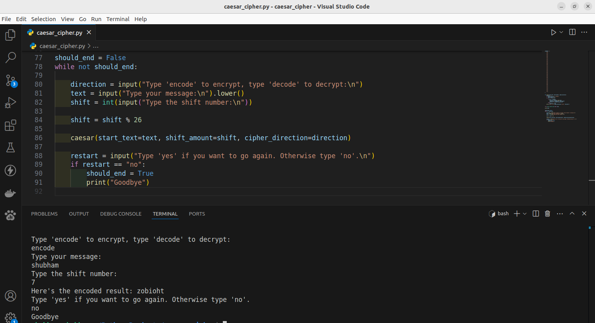

# Caesar Cipher

## Screenshot

This project implements the Caesar Cipher, a classical encryption technique, using [Python 3](https://www.python.org/downloads). The program allows users to encrypt and decrypt messages by shifting letters of the alphabet by a specified number of positions. The user inputs a message and the shift value, and the program returns the encoded or decoded text. This project is ideal for learning about basic encryption algorithms, string manipulation, and user input handling in Python.

## ⚙️ Languages or Frameworks Used:

+ `The script was created with -`
  + [Python3](https://www.python.org/downloads)
+  `the built-in functions in it.`

## 🌟 How to run:

+ `python3 caesarcypher.py` 

+ `Enter string to decrypt: hello  -->  mjqqt`
